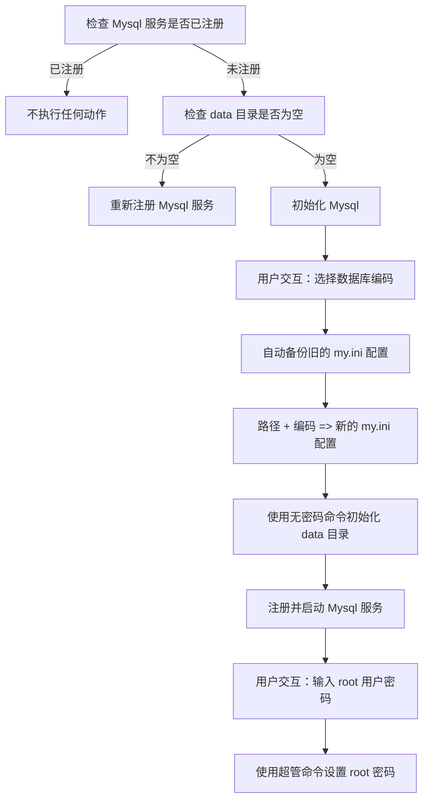
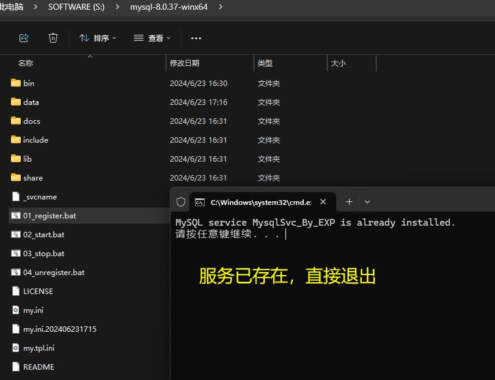
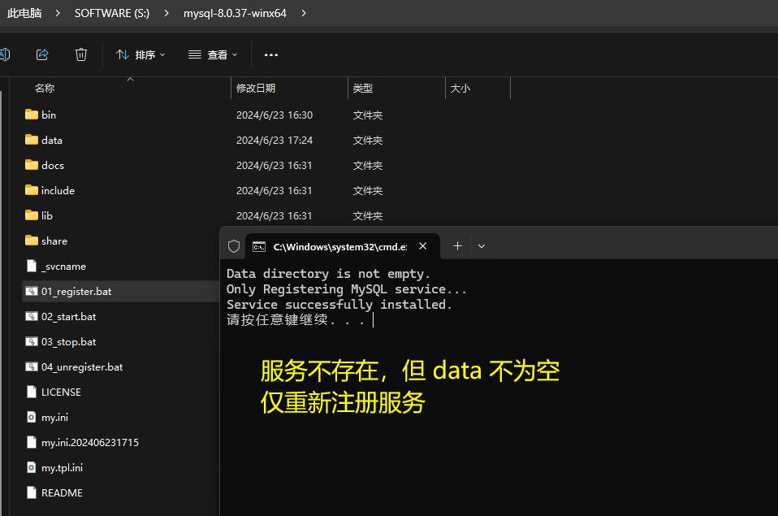
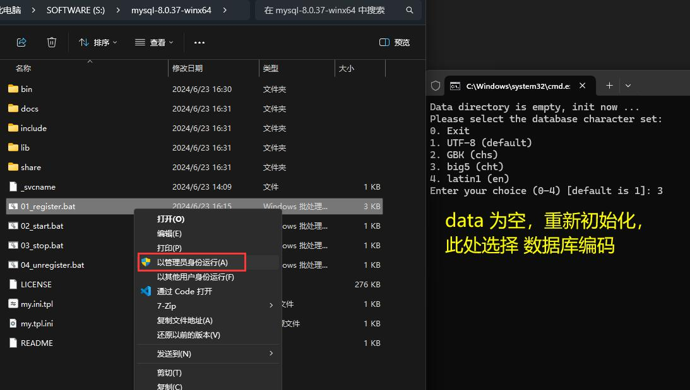
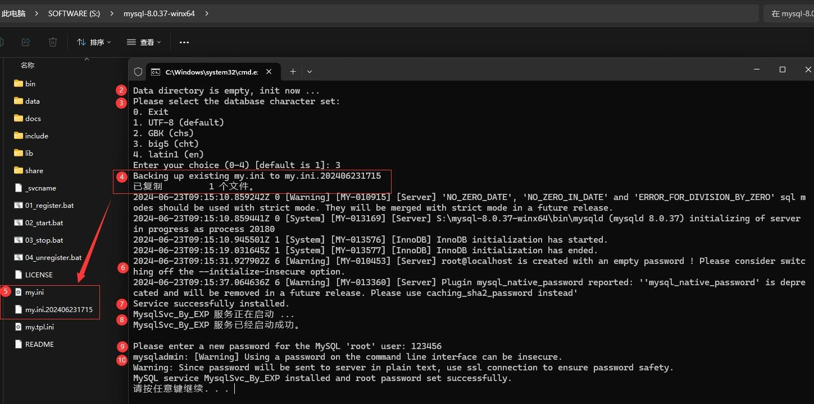
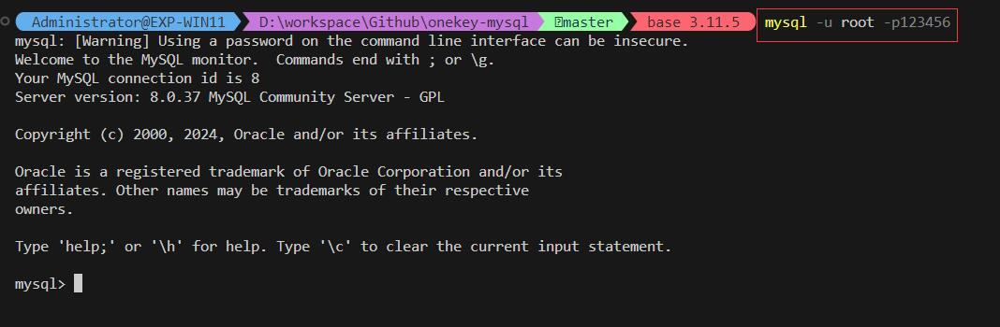
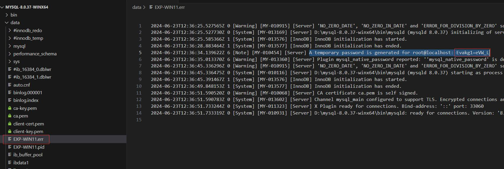
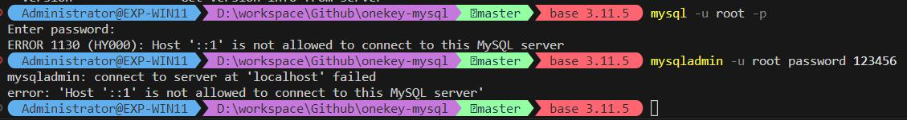

# onekey-mysql

> 一键 注册/反注册/启动/停止 mysql 脚本


## 0x00 前言

由于 Mysql 一直都有着极为严格的登录权限校验、以致不少同学都会被卡在初始化的地方，极让人抓狂。

很多时候在 [Mysql 官网下载](https://dev.mysql.com/downloads/mysql/) 绿色版的 zip ，目的不过是想独立部署一个简单测试库进行验证，但 Mysql 不准 —— 你必须先处理各种弯弯绕绕的无关问题：

- 写配置项意义不明的配置文件： Mysql8 甚至不再提供模板
- 找到 root 用户的密码： Mysql8 竟然是随机生成的还藏起来
- 找到密码你还不一定能登录，你一定不陌生： `ERROR 1130 (HY000) Host is not allowed to connect to this MySQL server`
- 登录后还要修改 root 密码、修改权限
- 都做完后发现客户端还是无法连接： Mysql8 对密码做了加密
- ...

每次都要处理这么多工序，就很让人烦躁。

针对这些痛点，我做了 4 个开箱即用的一键脚本: [Github/Onekey-Mysql](https://github.com/EXP-Codes/onekey-mysql/)


## 0x10 脚本简介

以下脚本需要确保 Mysql 的**解压路径为纯英文**，并且使用**管理员权限**运行：

| 脚本 | 说明 | 关键词 |
|:---|:---|:---:|
| [_svcname](./win/_svcname) | Mysql 服务名称，被所有脚本读取 | 服务名称 |
| [01_register.bat](./win/01_register.bat) | Mysql 服务注册脚本，用于初始化或迁移位置 | 初始化，迁移 |
| [my.tpl.ini](./win/my.tpl.ini) | Mysql 配置文件模板，配合服务注册脚本使用 | 配置模板 |
| [02_start.bat](./win/02_start.bat) | Mysql 服务启动脚本 | 启动 |
| [03_stop.bat](./win/03_stop.bat) | Mysql 服务停止脚本 | 停止 |
| [04_unregister.bat](./win/04_unregister.bat) | Mysql 服务反注册脚本，用于迁移位置 | 迁移 |


## 0x20 使用方式

### 0x21 安装

1. 从 [官网下载](https://dev.mysql.com/downloads/mysql/) Mysql 的 zip 压缩包，解压到**纯英文路径** 
2. 把 [win](./win/) 目录下所有文件复制到 Mysql 的解压后的根目录
3. 执行 [`01_register.bat`](./win/01_register.bat) 脚本初始化，过程中有两次交互：
    - 选择数据库编码： UTF-8（默认），GBK（简中），BIG5（繁中），latin1（英文）
    - 设置 root 用户密码
4. 完成后会生成：
    - my.ini 配置文件
    - data 数据存储目录

## 0x22 启停

- 启动脚本： [`02_start.bat`](./win/02_start.bat)
- 停止脚本： [`03_stop.bat`](./win/03_stop.bat)


## 0x23 迁移

如果要迁移 Mysql 到别的位置，依次执行：

1. 停止并反注册服务： [`04_unregister.bat`](./win/04_unregister.bat)
2. 移动整个 Mysql 到新位置
3. 执行 [`01_register.bat`](./win/01_register.bat) 脚本重新注册：
    - 此时因为检测到 data 目录已存在，并不会重新初始化
    - 但是会自动备份 my.ini 配置文件，然后根据新位置重新生成一个


## 0x24 卸载

如果要完全卸载 Mysql 服务，执行 [`04_unregister.bat`](./win/04_unregister.bat) 即可。

> 此脚本只是停止服务 + 反注册，不会删除 data 目录，数据并不会丢失


## 0x30 注册脚本解读

<details>
<summary>逻辑解读</summary>
<br/>

这些脚本中，核心是注册脚本，这里为大家解读一下脚本逻辑：



1. 检查 Mysql 服务是否已注册，若已注册不执行任何动作



2. 检查 `data` 目录是否为空，若不为空则仅重新注册；若为空则进入初始化流程




3. 用户交互：要求选择【数据库编码】




4. 自动备份旧的 `my.ini` 配置
5. 根据【脚本所在位置】和【数据库编码】，利用 `my.tpl.ini` 配置模板生成新的 `my.ini` 配置
6. 执行 `mysqld --initialize-insecure` 命令以无密码方式初始化 `data` 目录
7. 执行 `mysqld --install` 命令注册 Mysql 服务
8. 执行 `net start mysql` 命令启动 Mysql 服务
9. 用户交互：要求输入 root 用户【密码】
10. 执行 `mysqladmin -u root password ${密码}` 设置 root 密码



11. 随后任意终端或客户端，即可登录 Mysql



</details>


## 0x40 其他过程记录

<details>
<summary>过程记录</summary>
<br/>

### 0x41 初始化没有打印 root 密码

假如不使用无密码方式 `mysqld --initialize-insecure` 初始化数据库，而是使用 `mysqld --initialize` 初始化，会为 root 用户生成一个随机密码。

但如果在初始化时没有使用 `--console` 参数输出到控制台，很多同学就因为不知道密码而无法登录。

此时可以在 `data/{主机名}.err` 日志文件中查找关键字 `A temporary password` 得到初始密码:




### 0x42 初始化后本地连接无法通过权限检查

我在刚开始做这 4 个脚本的时候发现，初始化后无论如何也无法登录进去，不管有密码还是没密码初始化，甚至 mysqladmin 超管也无法连接，一直报错 `ERROR 1130` （权限检查不通过）:



查了 2 天才发现原因是我把用于 docker 的 mysql 配置项复制到 my.ini 了：

```ini
skip-host-cache     ; 禁用主机 DNS 缓存，解决某些 DNS 解析问题
skip-name-resolve   ; 禁用 DNS 解析，只使用 IP 地址进行权限检查
```

这两个配置项在 docker 环境是正常的，但是到了物理机就会出问题，删除后恢复正常。


### 0x43 一键脚本无法获取服务名

实测某些 win 系统无法正常通过 `set /p SVC_NAME=<_svcname` 命令获取服务名，此时批量把 01 ~ 04 四个 bat 脚本中的这条命令、都替换成 `set "SVC_NAME=MysqlSvc_By_EXP"` 即可。

> 服务名 `MysqlSvc_By_EXP` 可随意改，四个脚本保持一致即可，但是修改后就不要动了，尤其是旧服务还没停止 + 反注册的前提下，否则会因为端口被占用导致更名后的服务无法启动

</details>